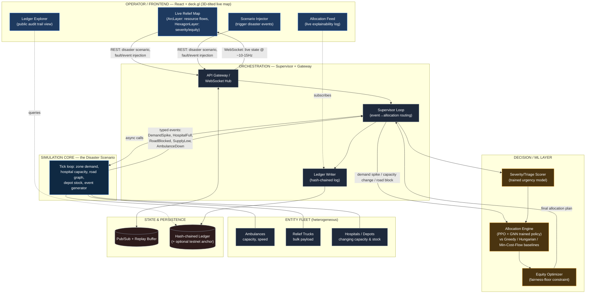

# RAAHAT — Intelligent & Transparent Disaster Relief Allocation Platform
### System Architecture — EL-02: Intelligent & Transparent Disaster Relief Resource Allocation
### ELEVATE 1.0 — DJ Sanghvi College of Engineering

> **This folder is for PS EL-02 (Disaster Relief) only.** It is intentionally separate from `~/elevate-swarm-orchestration/` (PS EL-05, Drone Swarm) — different team, different submission, don't mix the two. Same documentation structure/quality bar is used across both so either of you can build independently from your own folder.

---

## 0. How to use this document

Written for two readers:
1. **This doc's author (architecture pass)** — captures every decision and why.
2. **The builder (coding pass)** — Section 5 is the production-scale architecture vision (for the Feasibility slide + Q&A). **For actually building the hackathon prototype, use `BUILD-PLAN.md` in this same folder** — it's the lean, fast, deployable version of this exact architecture.

Project name: **RAAHAT** (Hindi/Urdu: "relief") — use as repo name, service prefixes, PPT title.

---

## 0.5 System Architecture Diagram



**Read it top-to-bottom as the decision path, bottom-to-top as the event path**: a disaster event (demand spike, road block, hospital hitting capacity) is born in the Simulation Core (L4), rises through the Supervisor (L2), gets scored for urgency and routed through the trained Allocation Engine + Equity Optimizer (L3), every movement of resources/funds is written to the hash-chained Ledger, and the result streams back to the Live Relief Map (L1) in real time. The judge's "trigger an earthquake spike" click at the top travels the same path in reverse.

Use this Mermaid version as the build reference; generate a polished graphic version via Gemini for the slide using the prompt in §4.

---

## 1. PRD → System Mapping (traceability)

Every line of the official problem statement mapped to a concrete module — this is the evidence slide 2/3 of the PPT is built from.

| PRD Requirement (verbatim intent) | System Component | Where it lives |
|---|---|---|
| Dynamically allocate scarce emergency resources based on changing demand, infrastructure, transport constraints, capacity | **Allocation Engine** — PPO+GNN trained policy over the live road/demand graph | `services/allocator` |
| Model affected populations with different urgency levels | **Triage/Severity Scorer** — trained urgency model, not a hardcoded priority list | `services/allocator/triage.py` |
| Ambulances/relief resources with varying capabilities, hospitals with changing capacity | **Entity Registry** — heterogeneous agent types with distinct capability profiles | `services/sim/entities.py` |
| Disrupted road networks | **Road Graph Engine** — weighted directed graph, edges carry capacity/blockage/travel-time state | `services/sim/graph.py` |
| Limited medical supplies or funds | **Depot/Stock Model** — finite resource pools per depot, consumed on allocation | `services/sim/world.py` |
| Dynamically reallocate rather than static near-hospital/first-come rules | Trained policy benchmarked live against Greedy/nearest-hospital and Hungarian-optimal baselines | `services/allocator` + demo scenario |
| Transparent, traceable records of resource/fund distribution, with privacy controls | **Hash-chained Ledger** — every movement is an append-only, cryptographically linked record; PII (beneficiary identity) kept off-ledger, only aggregate/zone-level data on-chain | `services/ledger` |
| Blockchain or tamper-evident tech "may be explored" | Lean version: SHA-256 hash-chain (tamper-evident, verifiable, zero infra). Stretch: periodic Merkle-root anchor to a public testnet smart contract for a genuine on-chain audit trail | `services/ledger` (+ optional `contracts/` for stretch) |
| Demonstrate allocation decisions change as demand/infrastructure/resources change | **Scenario Injector** — judge-triggerable event panel (spike demand, block road, drop hospital capacity, deplete depot) | `frontend` → `services/sim` event API |
| Provide transparent and verifiable tracking from allocation to final distribution | **Ledger Explorer** panel — anyone can re-verify the hash chain in the browser, no admin access needed | `frontend/src/panels/LedgerExplorer.tsx` |

**Explicit framing for Q&A:** the brief explicitly allows "blockchain **or** other tamper-evident technologies" — we deliberately chose a hash-chained append-only ledger as the core (fast, verifiable, zero extra infra) with a real testnet smart-contract anchor as a documented stretch goal, rather than building a full token/escrow system that the PRD never actually asked for. This is a stronger, more honest answer than bolting on Solidity contracts nobody has time to audit properly in a hackathon window.

---

## 2. Why this stack (and why it stays lean on purpose)

| Layer | Choice | Why |
|---|---|---|
| Simulation + orchestration + ML inference | **Python (FastAPI, single process, asyncio)** | One language, one deployable service — fewer moving parts for a coding agent to build correctly fast; see `BUILD-PLAN.md` for the full reasoning (same logic applied to the drone-swarm PS, this doc reuses the proven pattern) |
| Allocation policy training | **PyTorch + PyTorch Geometric (GNN) → ONNX for inference** | The problem is structurally a graph (zones/hospitals/depots as nodes, roads as edges) — a GNN-based policy (PPO-GNN) is directly precedented for exactly this problem shape (humanitarian aid routing on road networks, risk-aware), and is a genuinely trainable, reproducible pipeline — not a pretrained wrapper |
| Baselines (for the comparison demo) | **Greedy nearest-hospital, `scipy` Hungarian algorithm, min-cost-flow (`networkx`/`OR-Tools`)** | Classic OR baselines — cheap to implement, and the thing that proves the trained policy is measurably better, not just "an AI did something" |
| Ledger | **SHA-256 hash chain in SQLite/Postgres** (+ optional testnet smart contract anchor) | Tamper-evident and independently verifiable without needing gas fees, wallets, or a blockchain explorer to demo live — exactly matches what production disaster-relief ledger projects (e.g. AidLedger, CrisisChain) actually use at their core: a Merkle/hash-chained structure, with full smart-contract systems reserved for real-money settlement, which is out of scope for a demo |
| Frontend | **React + TypeScript + deck.gl (over MapLibre/Mapbox GL)** | deck.gl gives genuinely impressive, map-accurate 3D-tilted visuals — `ArcLayer` for animated resource-flow arcs between depots/zones, `HexagonLayer`/`HeatmapLayer` for live severity/equity — while staying geographically honest (unlike a generic 3D scene, every visual element maps to a real lat/lon), which matters because this problem is inherently geographic | Pattern used directly by PPO-GNN humanitarian routing's own route-on-map visualizations, extended to be live/interactive instead of a static plot |
| State fan-out | **WebSocket native in FastAPI** (Redis added only if scaling past one instance) | Same reasoning as the drone-swarm PS — don't add infra you don't need for a single-instance demo |

**One-sentence pitch for slide 3:** *"The allocation problem is structurally a graph — zones, hospitals, and depots as nodes, roads as edges — so we use a GNN-based trained policy instead of a generic MLP, benchmarked live against classical OR baselines (Hungarian, min-cost-flow), with every resulting resource and fund movement written to a tamper-evident hash-chained ledger anyone can independently verify."*

---

## 3. Detailed Module Breakdown

### 3.1 Simulation Core — the Disaster Scenario
- **Road graph**: weighted directed graph (`networkx` under the hood), nodes = zones/hospitals/depots, edges = roads carrying `travel_time`, `capacity`, `blocked: bool`.
- **Zones**: each has a population, current demand (food/water/medicine/blood units needed), and a dynamically computed **urgency score** (not static — rises over time if unmet, spikes on disaster events).
- **Hospitals**: bed capacity, ICU capacity, specialty tags — capacity depletes as patients are routed in, frees up over time.
- **Depots**: finite stock per resource type, replenished on a schedule (mimics real relief convoys).
- **Entities (heterogeneous, per PRD)**: `Ambulance` (fast, small capacity, patient-only), `ReliefTruck` (slow, bulk food/water/medicine), implicitly the Hospitals/Depots act as fixed-capacity nodes.
- **Event generator**: scripted disaster escalation (e.g. aftershock → new demand spike in a zone, flood → road edge becomes `blocked`, mass-casualty → hospital capacity suddenly consumed) — this is what the Scenario Injector also lets a judge trigger manually.
- **Tick loop**: `asyncio` task, ~5-10Hz is plenty for a resource-allocation sim (positions move slower than a drone sim; state-change events matter more than frame-perfect physics).

### 3.2 Triage/Severity Scorer (trained)
- Small trained model (logistic regression or shallow MLP) over zone features (population, injury-severity mix, unmet-demand duration, vulnerability index) → urgency score. Trained on synthetic/procedurally generated scenario data (label: "how much unmet demand led to simulated worse outcomes") — genuinely trained, not a hardcoded weighted sum, even though it's intentionally simple.

### 3.3 Allocation Engine (the core ML claim)
- **Representation**: the live road/zone/hospital/depot graph, encoded as node + edge features.
- **Model**: PPO policy with a GNN encoder (PyTorch Geometric) — the GNN lets the policy reason about *network structure* (which zones are reachable, which roads are congested/blocked), which a plain MLP over flat features can't do.
- **Training**: headless, self-play against the simulation core, reward = served-demand − travel-time penalty − equity-violation penalty (see 3.4).
- **Baselines trained/implemented alongside it** for the live comparison: Greedy nearest-available, Hungarian-optimal static assignment, min-cost-flow (closest to the "lexicographic min-cost flow" approach used in reference disaster-optimization projects).
- **Inference**: exported to ONNX, loaded in-process — single-digit-millisecond decisions.

### 3.4 Equity Optimizer
- A configurable **equity floor** (operator-settable slider in the UI, directly inspired by the "equity floor and risk tolerance" dispatcher controls seen in reference disaster-optimization tooling): guarantees a minimum protected demand allocation to every zone before remaining supply is allocated by the trained policy's efficiency-maximizing pass. This is what stops the system from "optimally" starving small/remote zones in favor of raw throughput — explicitly call this out in the demo, it's a strong, judge-legible differentiator (the PRD doesn't ask for it, but it's exactly the kind of "social + technical hand-in-hand" depth that separates this from a pure optimization toy).

### 3.5 Ledger — Transparent & Traceable Tracking
- **Core (always built)**: every resource/fund movement (`depot X → zone Y, 50 units medicine, t=...`) becomes a record; each record stores `hash(prev_record_hash + this_record_data)` — a classic hash chain. Anyone can re-walk the chain and confirm no record was altered after the fact. Stored in SQLite/Postgres, served via a `/ledger` REST API and rendered in a **Ledger Explorer** panel in the frontend — this is the literal, demoable "transparent and traceable" requirement, verifiable live by a judge.
- **Privacy**: only zone-level/aggregate data goes on the ledger (matches the PRD's explicit "appropriate privacy controls" ask) — no individual beneficiary PII.
- **Stretch (optional, Phase 6.5 in `BUILD-PLAN.md`)**: periodically anchor the current Merkle root of the hash chain to a public testnet (e.g. Polygon Amoy) via a minimal single-function smart contract (`anchorRoot(bytes32 root)`), so the "blockchain" claim is backed by a real, verifiable on-chain transaction — without building a full token/escrow system the PRD doesn't require.

### 3.6 Orchestrator / Supervisor Loop
- Consumes the simulation's event queue; routes demand-spike/capacity-change/road-block events to the Allocation Engine; writes every resulting decision to the Ledger and to a human-readable **Allocation Feed** (same explainability pattern as the drone-swarm PS's Decision Feed) streamed over WebSocket.

### 3.7 Frontend — the Relief Command Map
- **Live Relief Map** (deck.gl over a real basemap): zones color-coded by fulfillment % / urgency, hospitals shown with a capacity gauge, `ArcLayer` animated arcs showing live resource flow from depots to zones, roads rendered dim/red when blocked, a 3D-tilted camera angle for visual depth without sacrificing geographic accuracy.
- **Scenario Injector**: buttons/map-clicks to trigger demand spikes, block a road, drop a hospital's capacity, deplete a depot — the judge's toy.
- **Allocation Feed**: scrolling human-readable log — *"Zone 7 demand spike (+40 units water) → reallocated 25 units from Depot-2, 15 from Depot-4 → equity floor maintained for Zone 3 → completed in 340ms"*.
- **Ledger Explorer**: a simple table/list of the hash-chain records with a "Verify Chain" button that re-walks and re-hashes client-side, visibly confirming integrity live.
- **Equity Floor slider**: operator control, directly affects the next allocation pass — makes the fairness trade-off tangible and interactive, not just a line in a slide.

---

## 4. Architecture Diagram — spec for image generation (Gemini)

```
Generate a clean, professional, dark-theme technical system architecture diagram,
widescreen 16:9, suitable for a hackathon pitch deck slide. Style: modern SaaS
infra diagram (rounded rectangles, soft drop shadows, thin connecting lines with
arrowheads, small technology icons/labels inside each box, subtle grid background),
dark navy (#0B1220) background, accent color electric blue (#3B82F6) for data-flow
lines, amber (#F5A623) for ML/decision components, emerald green (#10B981) for the
ledger/transparency components, white/light-gray text.

LAYOUT — 5 horizontal layers, top to bottom, labeled on the left margin:

[LAYER 1 — OPERATOR / FRONTEND]
  Box: "Relief Command Map — React + deck.gl (3D-tilted live map)"
    sub-labels: "Live Relief Map (ArcLayer flows, Hexagon severity heatmap)",
    "Scenario Injector", "Allocation Feed (live explainability log)",
    "Ledger Explorer (public audit trail)", "Equity Floor slider"

  ↓ WebSocket (live state)          ↑ REST (scenario events, equity floor setting)

[LAYER 2 — ORCHESTRATION]
  Box: "Supervisor / API Gateway — FastAPI"
  Box beside it: "Hash-chained Ledger (SQLite/Postgres)
    + optional testnet smart-contract anchor"

  ↓ events: DemandSpike, HospitalFull, RoadBlocked, SupplyLow, AmbulanceDown
  ↑ allocation commands, ledger writes

[LAYER 3 — DECISION / ML LAYER]  (amber accent, 3 boxes side by side)
  Box: "Triage/Severity Scorer (trained urgency model)"
  Box: "Allocation Engine — PPO + GNN trained policy (ONNX runtime)
    vs Greedy / Hungarian / Min-Cost-Flow baselines — benchmarked live"
  Box: "Equity Optimizer (fairness-floor constraint)"

[LAYER 4 — SIMULATION CORE]  (blue accent, wide box)
  Box: "Disaster Scenario Engine"
    sub-labels: "Road graph (zones/hospitals/depots as nodes, roads as edges)",
    "Demand/capacity/stock state", "Event generator (disaster escalation)",
    "Scenario Injection API"

[LAYER 5 — ENTITY FLEET]  (bottom, icons in a row)
  Icon + label: "Ambulances — fast, patient transport"
  Icon + label: "Relief Trucks — bulk food/water/medicine"
  Icon + label: "Hospitals — changing bed/ICU capacity"
  Icon + label: "Depots — finite resource stock"

Add a legend bottom-right: blue = state data flow, amber = ML/decision flow,
green = ledger/transparency flow.

Add a callout bubble near the top near the Scenario Injector box:
"Judge triggers a disaster event here → flows down → Allocation Engine replans
in real time → every resource movement logged to the ledger → visible on the
map in under a second"
```

If a one-shot render is messy, generate in two passes: skeleton boxes/connectors first, then ask for small flat-style icons (ambulance, truck, hospital cross, warehouse, map-pin, brain/chip, chain-link) added into the existing layout.

---

## 5. Build Plan — Phase by Phase (production-scale vision)

> **Note:** for the actual hackathon build, use `BUILD-PLAN.md` in this folder instead — it collapses this into a fast, deployable, token-efficient prototype while keeping every module above. The phases below are the documented "how this scales to a real deployment" answer for the Feasibility slide and Q&A.

### Phase A — Simulation & Graph Engine
Road graph, zones, hospitals, depots, entity types, disaster event generator, scenario injection API.

### Phase B — Baselines + Trained Allocation Policy
Implement Greedy/Hungarian/min-cost-flow baselines first. Build the headless training harness (self-play against Phase A). Train the PPO+GNN policy. Export to ONNX, benchmark inference latency.

### Phase C — Triage Scorer + Equity Optimizer
Train the urgency model. Implement the equity-floor constraint pass on top of the Allocation Engine's output.

### Phase D — Ledger
Hash-chain implementation, REST API, chain-verification endpoint. (Stretch: testnet smart-contract anchor.)

### Phase E — Orchestrator / Supervisor Loop
Event routing, decision logging, WebSocket broadcast.

### Phase F — Relief Command Map (frontend)
deck.gl live map, Scenario Injector, Allocation Feed, Ledger Explorer, Equity Floor slider.

### Phase G — Demo Scenarios & Hardening
Script 3 scenarios (demand spike, road block + reroute, hospital-capacity cascade), run the baseline-vs-trained comparison, stress test, replay-buffer demo safety, rehearse.

### Phase H — Production hardening (post-hackathon path, for Q&A)
Peel the Allocation Engine into its own service, swap SQLite for managed Postgres, add Redis for multi-instance WebSocket fan-out, integrate a real road-network data source (OpenStreetMap) and real disaster-event feeds (e.g. USGS/GDACS, as seen in reference disaster-relief platforms) in place of the synthetic generator.

---

## 6. Metrics to capture during build

| Metric | Captured in | Used on slide |
|---|---|---|
| Allocator inference latency (ms) | Phase B | Feasibility |
| Mission/allocation completion time: Greedy vs Hungarian vs Min-Cost-Flow vs Trained GNN policy | Phase B/G comparison run | Innovation / Feasibility |
| Equity-floor effect: served-demand distribution with floor ON vs OFF | Phase C | Innovation |
| Ledger verification time (client-side re-hash) | Phase D | Feasibility |
| Event→replan visible latency on stage | Phase G | Technical Approach |
| Training reward curve | Phase B | Technical Approach |

---

## 7. Comparison vs. Existing Approaches (for Innovation slide)

| Existing approach | Limitation | RAAHAT |
|---|---|---|
| Nearest-hospital / first-come static dispatch | Explicitly what the PRD says to move beyond — no adaptation to changing conditions | GNN-based trained policy conditions on live graph state, benchmarked live against this exact baseline |
| Pure optimization/OR tools (LP/min-cost-flow only, no learning) | Fast and optimal for the single instant it's solved, but doesn't learn from patterns across scenarios, and we still keep this as a transparent, explainable baseline rather than discarding it | Trained policy + classical OR baselines run side by side — best of both, and the comparison itself is the evidence |
| Blockchain-heavy disaster-relief fund platforms (full smart-contract escrow/DeFi) | Significant build/audit overhead, often ends up as an un-auditable toy contract in a hackathon timeframe, doesn't address the dynamic-allocation problem at all | Hash-chained ledger at the core (fast, genuinely verifiable, zero extra infra) with the allocation problem actually solved, and a real testnet anchor possible as a stretch — transparency *and* intelligence, not transparency instead of intelligence |
| Dashboard-only "resource tracker" demos | Numbers on a dashboard, no real reallocation logic underneath | Every visible reallocation traces to a real trained model or a real classical baseline evaluated live — Allocation Feed shows the actual reasoning |

---
